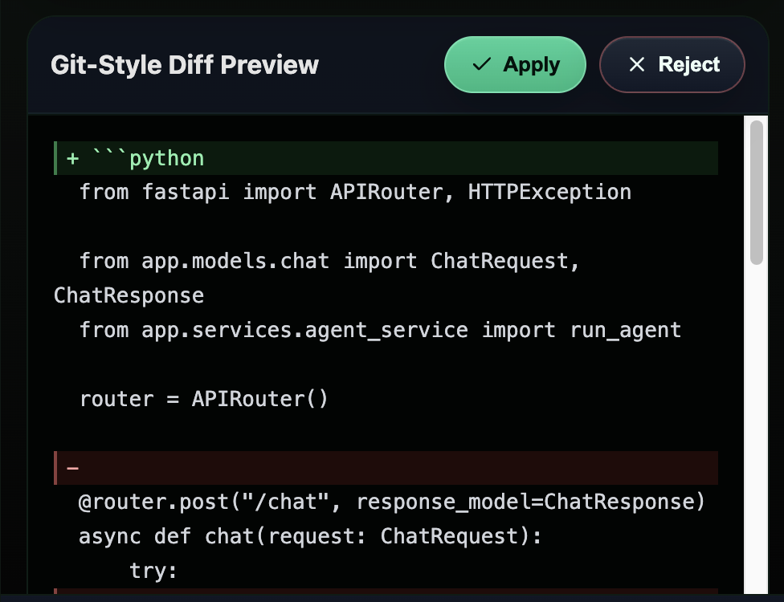
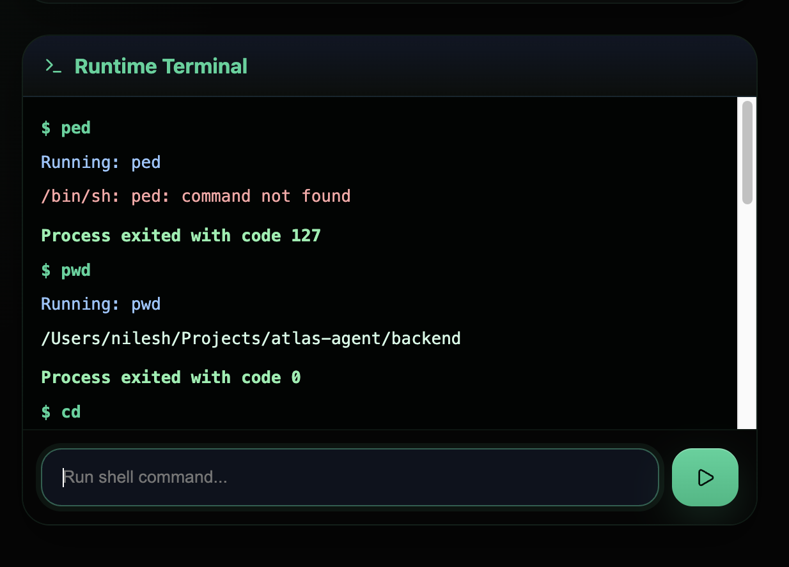

# Atlas-AI Agent

> Local AI developer runtime with autonomous code editing, terminal orchestration, filesystem tooling, and persistent agent workflows.

Atlas Agent is a local AI-powered developer environment inspired by tools like Cursor, OpenHands, and Claude Code.  
It combines AI-assisted code editing, terminal execution, project navigation, and persistent runtime workflows into a unified local engineering runtime.

The project was built to explore:
- AI orchestration systems
- developer tooling infrastructure
- async backend systems
- runtime execution environments
- local AI inference pipelines
- modern frontend/backend architecture

---

# Screenshots

## Main Dashboard


---

## Git-Style Diff Preview



---

## Persistent Runtime Terminal



---

# Core Features

## Local AI Runtime
- Local inference using Ollama
- Support for local models (Llama 3, Mistral, Phi-3, etc.)
- Streaming AI responses
- Async inference orchestration

---

## AI-Assisted Code Editing
- Open and edit project files
- AI-generated edit proposals
- Git-style diff preview
- Apply/reject workflow
- Safe approval-first editing model

---

## Persistent Terminal Runtime
- Live shell command execution
- Persistent working directory state
- Runtime execution logs
- Streaming stdout/stderr output
- Dangerous command blocking

---

## File System Tooling
- Recursive project navigation
- File explorer UI
- File read/write tooling
- Project-aware workflows

---

## Agent Execution Tracing
Atlas exposes execution traces for transparency and debugging.

Example:
- tool calls
- command execution
- reasoning steps
- runtime status

---

## SQLite Persistent Memory
Atlas maintains persistent local memory for:
- chat history
- terminal command history
- edit history

---

## Modern Frontend Interface
- React + Vite frontend
- Glassmorphism-inspired UI
- IDE-style layout
- Live terminal panel
- AI editing workflows
- Real-time streaming UX

---

# Architecture Overview

```text
Frontend (React + Vite)
│
├── Chat Interface
├── File Explorer
├── AI Editor
├── Diff Preview
└── Runtime Terminal
        │
        ▼
Backend (FastAPI + WebSockets)
│
├── Chat API
├── Tool Execution Layer
├── File System APIs
├── Terminal Runtime
├── Agent Orchestration
├── SQLite Memory Layer
└── Ollama Integration
        │
        ▼
Local LLM Runtime (Ollama)
